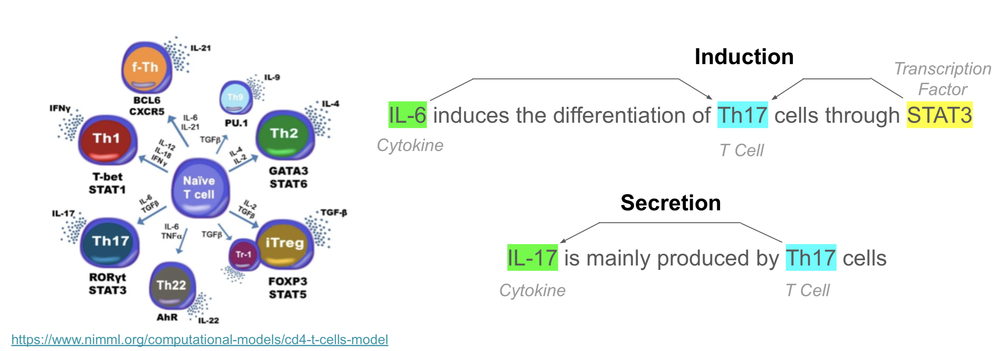
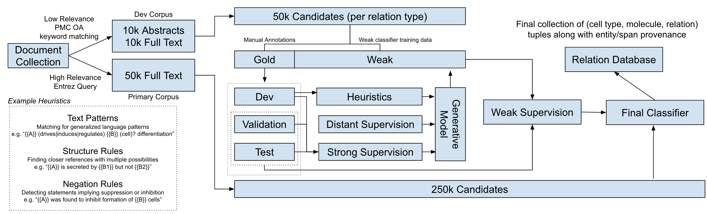

# T Cell Relation Extraction (TCRE)

This repository contains the scripts and analysis necessary to extract relationships between T cells, cytokines, and transcription factors from a large PMC corpus using [Data Programming](https://arxiv.org/abs/1605.07723).  In short, the purpose of this research is to identify relations like this often referenced as a small part of larger cell signaling networks:



## Information Flow

The relations are identified by a weakly supervised classifier trained using distant supervision from [immuneXpresso](http://immuneexpresso.org/immport-immunexpresso/public/immunexpresso/search), heuristics, text patterns, and standard supervised classifiers trained on a small manually labeled data split.  [Snorkel](http://snorkel.stanford.edu/) is used to develop a generative model on top of the classifications from these different sources and the weak labels from that model are then fed into a noise-aware classifier (trained on ~50k examples per relation).  A high-level overview of this information flow is shown below:



## Resources

This [Summary Notebook](https://nbviewer.jupyter.org/github/hammerlab/t-cell-relation-extraction/blob/master/results/summary.render.ipynb) contains a rolling account of many details such as how documents were selected, what labeling functions were developed, tokenization challenges, controlled vocabularies, preliminary classification performance results, etc.

An early draft of a pre-print is also available at [Extracting T Cell Function and Differentiation Characteristics from the Biomedical Literature](https://www.biorxiv.org/content/10.1101/643767v2).

Additional links:

  - [Annotated Data](data/annotation): This folder contains exports of csvs with annotated relations; the character coordinates 
    in these files are, however, specific to the ScispaCy tokenization applied to the documents
  - [Controlled Vocabularies](data/meta): These csv files contain mappings between the identifiers used to
    tag text entities and the originating ontology; for example, ```T-helper 17``` cells are assigned the identifier 
    ```CT919B4FF0A7605265``` and it is this identifier that is present in the relation "predictions" below that
    is also present in the mapping files within this folder alongside the external identifier for Cell Ontology (CL)
  - [Expression Signature Tokenization](src/tcre/tokenization.py): The functionality in the **[ptkn](src/ptkn)** package 
    can be used to decompose expression signatures strings such as **CD4+IL-17-IFN-γhi** into a more meaningful 
    representation like **\[CD4<sup>+</sup>, IL-17<sup>-</sup>, IFN-γ<sup>+</sup>\]**.  The 
    [tokenization.py](src/tcre/tokenization.py) module can be used to create the same tokenizer used in this 
    study while the notebooks in [pipeline/misc/tokenization](pipeline/misc/tokenization) show more basic
    examples as well as validation of this tokenization vs ScispaCy tokenization.
  - [Bulk Relations Export](data/results/predictions.csv.gz): This file is an export of the following dataframe and contains 
    relation probability predictions for ~1.3M candidate entity pairs; the entity text and normalized labels are also included 
    along with identifiers linking to other datasets in [data/meta](data/meta) that allow for tracing back 
    to ontology terms (e.g. CL and Cytokine Registry).
    
    ```
    RangeIndex: 1325861 entries, 0 to 1325860
    Data columns (total 11 columns):
    candidate_id    1325861 non-null int64
    date            1325861 non-null datetime64[ns]
    doc_id          1325861 non-null object
    ent1_cid        1325861 non-null object
    ent1_lbl        1325861 non-null object
    ent1_text       1325861 non-null object
    ent2_cid        1325861 non-null object
    ent2_lbl        1325861 non-null object
    ent2_text       1325861 non-null object
    prob            1325861 non-null float64
    type            1325861 non-null object
    ```   

